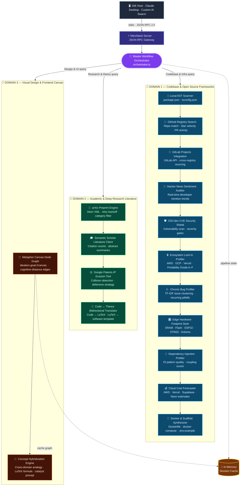

<div align="center">
  <h1>Ideation GOAT</h1>
  <p><strong>Cross-Domain Cross-Pollination & Ideation Engine for AI Agents</strong></p>
  
  <p>
    
    
    
  </p>
</div>

---

The Multi-Domain Semantic Architect Agent is an enterprise-grade Model Context Protocol server that operates as the analytical and creative subconscious of advanced AI coding agents. It exposes **24 autonomous diagnostic tools** spanning three distinct knowledge domains — codebases, academic research, and visual design — enabling AI agents to validate technical compatibility, audit supply-chain security, hybridize cross-domain concepts, and scaffold production-ready project architectures in a single unified pipeline.

Powered by **Gemini 3.1 Flash Lite** for high-speed structural reasoning, enforced by Zod-based schemas, and built natively with the **NitroStack** framework for serverless MCP hosting.

---

## 🏗️ System Architecture



---

## ⚡ Capability Matrix

### 🛠️ 24 Autonomous Tools & Resources

| # | Tool / Resource | Domain | Purpose |
|:--|:-----|:-------|:--------|
| 1 | `ideation-goat://canvas` (Resource) | D3 | Returns the constellation node graph data for the last active search query |
| 2 | `search_knowledge_grid` | D1 & D2 | Multi-domain semantic search with Target and Discovery modes |
| 3 | `breed_concepts` | D3 | Cross-pollinate two paradigms into a hybrid architectural blueprint |
| 4 | `bridge_code_and_theory` | D2 | Bidirectional code ↔ LaTeX mathematical translation |
| 5 | `assess_viability` | D2 | Patent collision detection and defensive evasion strategy |
| 6 | `search_academic_papers` | D2 | Parallel arXiv + Semantic Scholar literature sweep |
| 7 | `write_scaffolding_files` | D1 | Automated project skeleton and boilerplate generator |
| 8 | `verify_workspace_fit` | D1 | License and ecosystem compatibility auditor |
| 9 | `compose_solution_stack` | D1 | Multi-layer architectural decomposition and framework matching |
| 10 | `get_repo_health` | D1 | Real-time GitHub health, stars, and CVE telemetry |
| 11 | `profile_repo_hardware_footprint` | D1 | Edge device SRAM/Flash memory footprint estimation |
| 12 | `align_system_architecture` | D1 | Directory structure pattern detection and alignment scoring |
| 13 | `analyze_workspace_ast` | D1 | Zero-friction offline AST and dependency tree parser |
| 14 | `check_repo_health` | D1 | Supply-chain risk and maintenance health auditor |
| 15 | `check_ecosystem_lockin` | D1 | Vendor lock-in dependency scanner and portability grader |
| 16 | `analyze_repo_bugs` | D1 | TF-IDF semantic clustering of chronic bug patterns |
| 17 | `orchestrate_architectural_workflow` | D1 & D2 | Unified multi-step diagnostic pipeline orchestrator |
| 18 | `forecast_live_costs` | D1 | Cloud hosting cost estimator (AWS, Vercel, Supabase, Neon) |
| 19 | `auto_heal_parameters` | Core | Autonomous parameter type coercion and typo correction |
| 20 | `verify_identity_token` | Core | JWT authentication sandbox with scope verification |
| 21 | `profile_dependency_injection` | D1 | DI pattern quality scanner and modularity scorer |
| 22 | `generate_docker_scaffolding` | D1 | Multi-stage Dockerfile and docker-compose generator |
| 23 | `scan_local_cves` | D1 | OSV.dev vulnerability scanner with severity-based execution gates |
| 24 | `search_gitlab_repos` | D1 | GitLab project registry search integration |
| 25 | `audit_hacker_news_trends` | D1 | Real-time developer sentiment and mention trend auditor |

---

## 📦 Installation & Setup

### 1. Install Dependencies

```bash
npm install
```

### 2. Configure Environment Variables

```bash
cp .env.example .env
```

Open `.env` and populate the required keys (e.g., `LLM_API_KEY` for Gemini, `GITHUB_API_TOKEN`, etc.).

### 3. Build the Project

```bash
npm run build
```

### 4. Run the Server

For development mode (with watch/reload):
```bash
npm run dev
```

For production mode:
```bash
npm start
```

